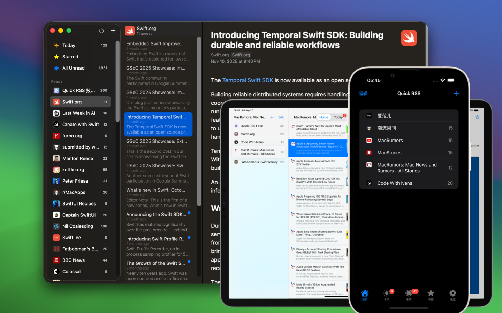
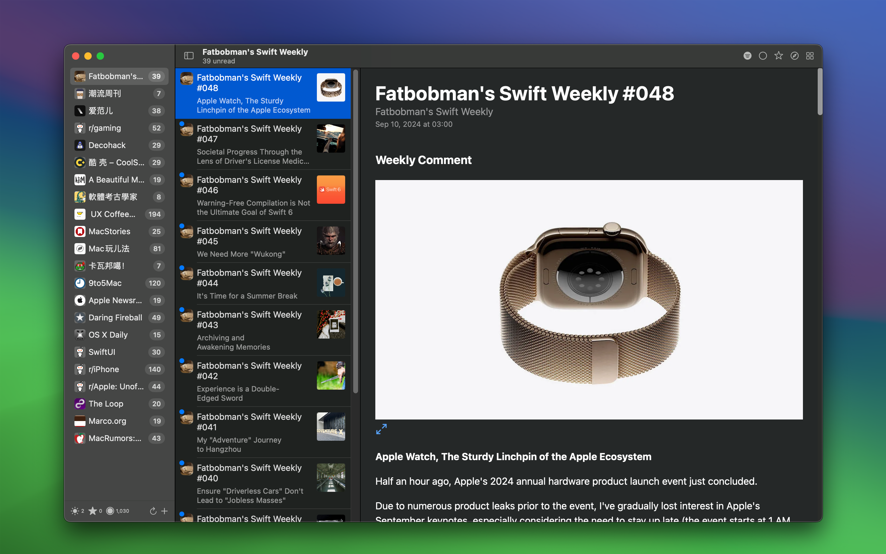
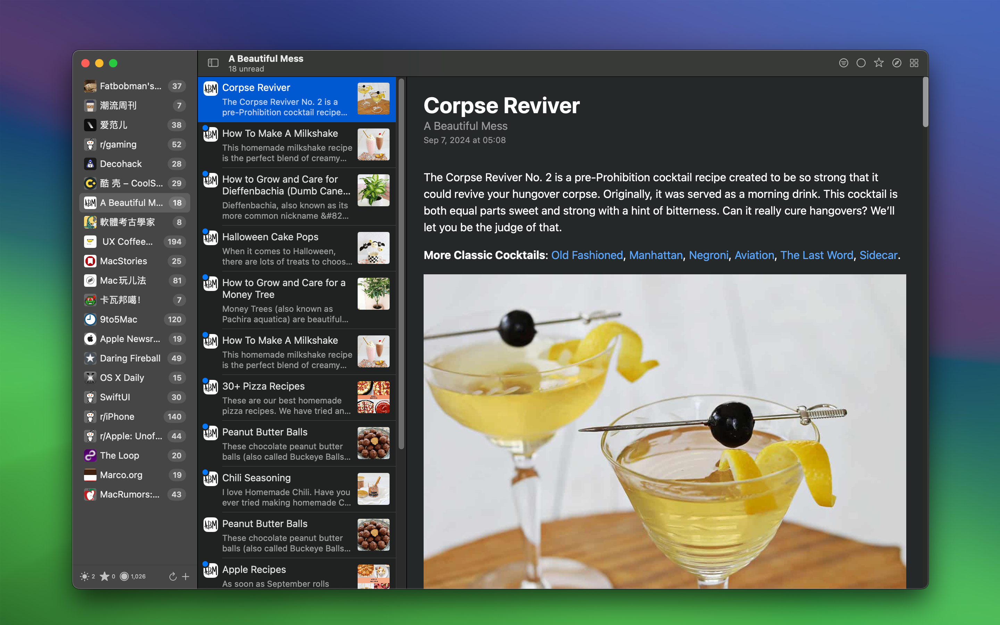
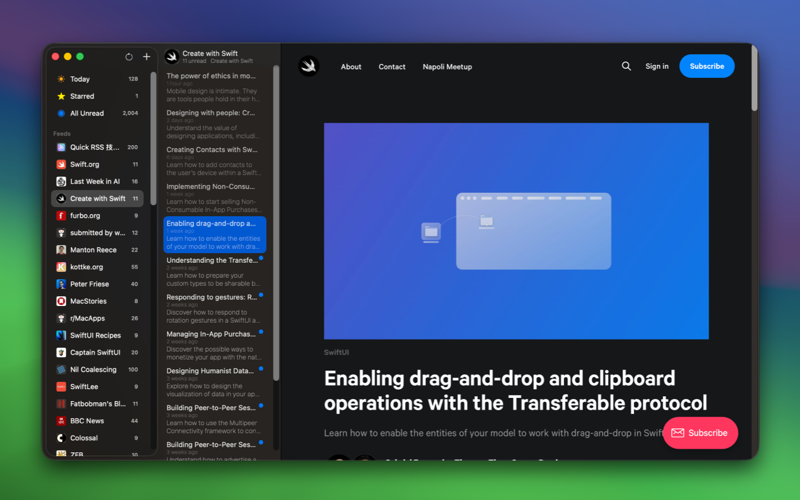
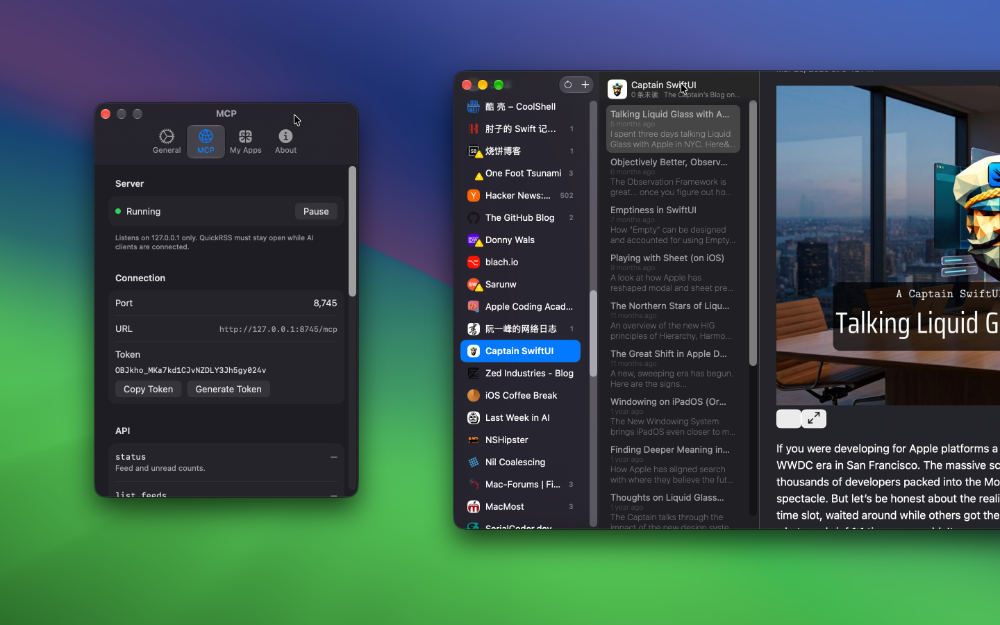

<div align="center">
  <br />
  <br />
  <a href="https://wangchujiang.com/quick-rss/">
  
  </a>
  <h1>Quick RSS</h1>
  <!--rehype:style=border: 0;-->
  <p>
    <a href="./README.zh.md">中文</a> • 
    <a target="_blank" href="https://github.com/jaywcjlove/quick-rss/issues/new?template=bug_report.yml">Contact & Support</a> • 
    <a href="./feeds/">RSS Feed</a> • 
    <a href="./feeds/feed_favorites.md">Feed Favorites</a> • 
    <a href="https://github.com/jaywcjlove/quick-rss/releases">Changelog</a>
  </p>
  <p>
    <a target="_blank" href="https://jaywcjlove.github.io/maslink/?id=6670696072&platform=mac" title="Quick RSS AppStore">
      
    </a>
    <a target="_blank" href="https://jaywcjlove.github.io/maslink/?id=6670696072&platform=iphone" title="Quick RSS for iOS">
      
    </a>
  </p>
</div>

<div align="center">

minimum OS requirement: `macOS 14.0` / `iOS 17.0`

</div>

**Quick RSS** is an easy-to-use, private, and intuitive desktop RSS reader. Whether you're a news enthusiast or someone who likes to follow blog posts and headlines, Quick RSS helps you effortlessly manage and read your favorite RSS feeds.





## Why Choose Quick RSS?

- **Supports Multiple RSS Feeds**: Whether it's news websites, blogs, or video updates, Quick RSS offers perfect support.
- **Lightweight and Efficient**: The app uses minimal system resources, ensuring that even during busy work sessions, it won't affect your system's performance.
- **Customizable**: Allows you to adjust your subscriptions and notification settings according to your preferences for more efficient information retrieval.





## Who is it for?

Quick RSS is ideal for anyone looking to efficiently access the latest news, especially for:

- News enthusiasts
- Blog followers
- Developers and designers who want to stay updated on the latest trends
- Users who want to consolidate multiple subscriptions into a unified management tool

## Experience Quick RSS Now!

Download Quick RSS today and bring a brand new RSS reading experience to your macOS. Whether tracking personal interests or staying on top of industry news, Quick RSS will become your go-to tool for managing subscriptions.

## Use Quick RSS with MCP



Quick RSS supports the [Model Context Protocol (MCP)](https://modelcontextprotocol.io/), allowing MCP clients such as Claude Desktop, Cursor, and VS Code to access your subscriptions.

1. Update Quick RSS to `v2.8.0` or later.
2. Enable the MCP service in Quick RSS Settings.
3. Copy the MCP configuration generated by the app and add it to your MCP client.
4. Restart the MCP client to browse feeds, find articles, and retrieve the latest content in a conversation.

The MCP service only accesses subscription and article data currently in Quick RSS. Add its configuration only to clients you trust.

### Configure Grok

Enable the MCP service in Quick RSS Settings, then copy the server address and token shown by the app.

```bash
# Add the Quick RSS MCP server
grok mcp add --transport http quickrss "http://127.0.0.1:8745/mcp?token=<TOKEN>"
# Remove the Quick RSS MCP server
grok mcp remove quickrss
# List configured MCP servers
grok mcp list
# Diagnose the Quick RSS MCP server connection
grok mcp doctor quickrss
```

You can also edit the configuration file directly:

```bash
vim ~/.grok/config.toml
```

Add this configuration, replacing `<TOKEN>` with the token shown by Quick RSS:

```toml
[mcp_servers.quickrss]
url = "http://127.0.0.1:8745/mcp?token=<TOKEN>"
enabled = true
```

Or:

```ini
[mcp_servers.quickrss]
url = "http://127.0.0.1:8745/mcp"
headers = { "Authorization" = "Bearer ${QUICKRSS_MCP_TOKEN}" }
```

Or:

```ini
[mcp_servers.quickrss]
command = "/Applications/QuickRSS.app/Contents/MacOS/QuickRSS"
args = ["--mcp"]
enabled = true
```

### Test the connection

In a Grok conversation with the Quick RSS connector enabled, send:

```text
List the five most recently updated articles in my Quick RSS subscriptions, including each title, feed, and publication date.
```

You can also enter `/mcps` in Grok to check whether the MCP server is running.

When the connection succeeds, Grok calls a Quick RSS MCP tool and returns articles from your current subscriptions.

<br />

## RSS Feed

We have curated some high-quality RSS feeds and encourage you to share your favorite subscriptions. Additionally, we have created a [Quick RSS Feed](./feeds/) to collect and share tech-related content! If you have articles, software, or resources to recommend, feel free to contribute via [issue](https://github.com/jaywcjlove/quick-rss/issues/new/choose). Your submissions will be automatically added to our RSS feed, enriching the content for the community.

```
https://wangchujiang.com/quick-rss/feed.xml
```

My [RSS Feed Favorites](./feeds/feed_favorites.md)

```
https://wangchujiang.com/quick-rss/opml.xml
```

<br />

## Other RSS Feed

- SwiftUl Recipes: https://swiftuirecipes.com/blog.rss
- MacStories https://www.macstories.net/feed
- Fatbobman's Swift Weekly https://weekly.fatbobman.com/feed
- Marco.org https://marco.org/rss

Here are some recommended RSS feeds. Feel free to share your favorite RSS feeds with us.

<!--idoc:config:
site: Quick RSS
title: A powerful and intuitive macOS desktop RSS reader that helps you manage and read your favorite RSS feeds with ease. - 
keywords: Quick RSS, RSS reader, macOS RSS app, desktop RSS, news aggregator, RSS feed manager
-->