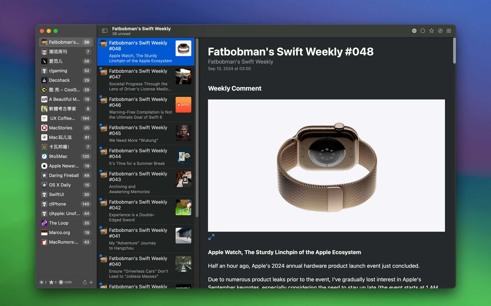

   
   
  
  <h1>Quick RSS</h1>
  <!--rehype:style=border: 0;-->
  

    <a href="./README.md">English</a> • 
    <a target="_blank" href="https://wangchujiang.com/#/contact">联系&支持</a>
  

  

    
  

最低操作系统要求：`macOS 14.0`

「Quick RSS」是一款简单易用、私密且功能直观的桌面 RSS 订阅阅读器应用，无论你是资讯狂热者，还是喜欢跟进博客文章、新闻头条，Quick RSS 都能帮助你轻松管理和阅读你喜爱的 RSS 订阅源。

## 为何选择 Quick RSS？

- 支持多种 RSS 订阅源：无论是新闻网站、博客、还是视频更新，Quick RSS 都能完美支持。
- 轻量且高效：应用占用系统资源少，确保即使在繁忙的工作中，也不会影响你的系统性能。
- 自由定制：允许你根据喜好调整订阅内容和通知设置，让信息获取更高效。

## 适用于谁？

Quick RSS 适合所有希望高效获取最新资讯的人群，尤其适合：

- 新闻爱好者
- 博客追随者
- 开发者和设计师，了解最新技术趋势
- 想要整合多个订阅源进行统一管理的用户

## 快来体验 Quick RSS！

立即下载 Quick RSS，为你的 macOS 带来全新的 RSS 阅读体验。无论是个人兴趣的追踪，还是行业新闻的获取，Quick RSS 都能成为你理想的订阅管理工具。

<!--idoc:config:
title: 「Quick RSS」是一款功能强大且直观的 macOS 桌面 RSS 阅读器，可帮助您轻松管理和阅读您最喜爱的 RSS 源。 - 
keywords: Quick RSS, RSS 阅读器, macOS RSS 应用, 桌面 RSS, 新闻聚合器, RSS 订阅管理器
-->