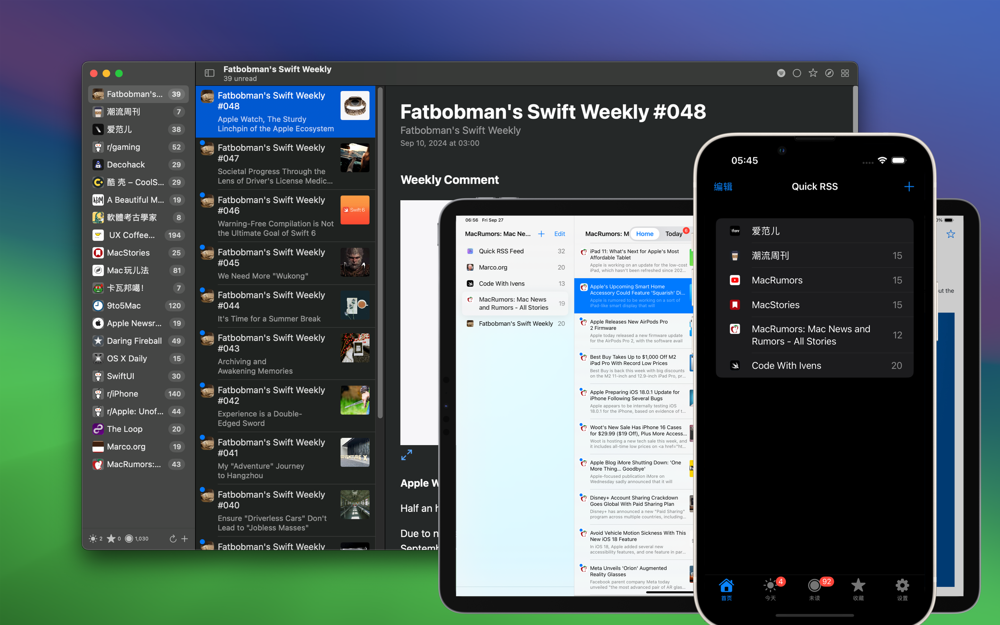

<div align="center">
  <br />
  <br />
  
  <h1>Quick RSS</h1>
  <!--rehype:style=border: 0;-->
  <p>
    <a href="./README.md">English</a> • 
    <a target="_blank" href="https://github.com/jaywcjlove/quick-rss/issues/new?template=bug_report_cn.yml">联系&支持</a> • 
    <a href="./feeds/">RSS 源推荐</a> • 
    <a href="./feeds/feed_favorites.zh.md">订阅收藏</a> • 
    <a href="https://github.com/jaywcjlove/quick-rss/releases">变更日志</a>
  </p>
  <p>
    <a target="_blank" href="https://apps.apple.com/app/quick-rss/6670696072?platform=mac" title="Quick RSS AppStore">
    </a>
    <a target="_blank" href="https://apps.apple.com/app/regex-mate/6670696072?platform=iphone" title="Quick RSS for iOS"></a>
  </p>
</div>

<div align="center">

最低操作系统要求：`macOS 14.0` / `iOS 17.0`

</div>

「Quick RSS」是一款简单易用、私密且功能直观的桌面 RSS 订阅阅读器应用，无论你是资讯狂热者，还是喜欢跟进博客文章、新闻头条，Quick RSS 都能帮助你轻松管理和阅读你喜爱的 RSS 订阅源。




## 为何选择 Quick RSS？

- 支持多种 RSS 订阅源：无论是新闻网站、博客、还是视频更新，Quick RSS 都能完美支持。
- 轻量且高效：应用占用系统资源少，确保即使在繁忙的工作中，也不会影响你的系统性能。
- 自由定制：允许你根据喜好调整订阅内容和通知设置，让信息获取更高效。


## 适用于谁？

Quick RSS 适合所有希望高效获取最新资讯的人群，尤其适合：

- 新闻爱好者
- 博客追随者
- 开发者和设计师，了解最新技术趋势
- 想要整合多个订阅源进行统一管理的用户

## 快来体验 Quick RSS！

立即下载 Quick RSS，为你的 macOS 带来全新的 RSS 阅读体验。无论是个人兴趣的追踪，还是行业新闻的获取，Quick RSS 都能成为你理想的订阅管理工具。

<br />

## RSS 源推荐

我们汇集了一些优质的 RSS 源，欢迎分享您喜爱的订阅内容。同时，我们还推出了一个 [Quick RSS Feed](./feeds/)，用于记录和分享技术相关的内容！如果您有文章、软件或资源推荐，欢迎通过 [issue](https://github.com/jaywcjlove/quick-rss/issues/new/choose) 进行投稿、推荐或自荐，它们将会自动添加到我们的 RSS 源中，共同丰富社区内容。

```
https://wangchujiang.com/quick-rss/feed.xml
```

我的 [RSS 订阅收藏](./feeds/feed_favorites.zh.md)

```
https://wangchujiang.com/quick-rss/opml.xml
```

<br />

## 其它 RSS 源

- 阮一峰的网络日志 https://www.ruanyifeng.com/blog/atom.xml
- 冯唐博客 https://www.fengtang.com/feed/
- 云风的 BLOG https://blog.codingnow.com/atom.xml
- 潮流周刊 https://weekly.tw93.fun/rss.xml
- 爱范儿 http://www.ifanr.com/feed
- Mac玩儿法 https://www.waerfa.com/feed
- 卡瓦邦噶！ https://www.kawabangga.com/feed
- 酷 壳 – CoolShell https://coolshell.cn/feed
- UX Coffee 设计咖 https://uxcoffee.com/feed/audio.xml

这里汇集了一些推荐的 RSS 源，欢迎分享您喜爱的 RSS 源。

<!--idoc:config:
title: 「Quick RSS」是一款功能强大且直观的 macOS 桌面 RSS 阅读器，可帮助您轻松管理和阅读您最喜爱的 RSS 源。 - 
keywords: Quick RSS, RSS 阅读器, macOS RSS 应用, 桌面 RSS, 新闻聚合器, RSS 订阅管理器
-->